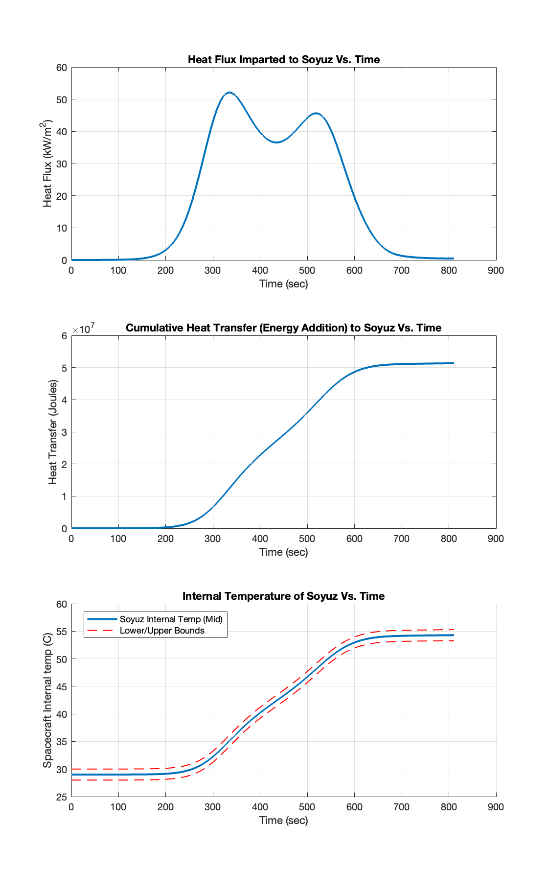

# Spacecraft-Reentry-Sim

## What is this?
This repository houses all code for the AAE 338 (Thermal Sciences) final project for Purdue University.

This project was inspired by the ECS system failure and coolant leak on the Soyuz MS-22 vehicle. Soyuz MS-22 was impacted by a micro-meteor causing a severe leak of onboard coolant on the ECS radiatior loops. thus, the crew were forced to re-enter Earth on a separate rescue vehicle (Soyuz MS-23), leaving the damaged spacecraft to re-enter autonomously.

Our group was interested in simulating the re-entry of Soyuz MS-22 using knowledge from dynamics classes. Additionally, we leveraged knowledge from AAE 338 to calculate the heating and internal temperature of the spacecraft over time. Ultimately, we were interested in assessing the possibility of crew survival if they were forced to re-enter on the damaged spacecraft.

Feel free to browse our code! The code is thoroughly commented so it should be readable to outsiders.

## Running Instructions
The project was initially written in Python, but we instead switched to MATLAB to make it easier for all group members to understand the code.

To run this project, simply use MATLAB to run the `Reentry_Runner.m` script. This main file will make all the calls necessary to plot the re-entry profile and thermal analysis.

## Results
The code in this repository produces the following plots:

### Re-entry Trajectory Simulation Results

### Re-entry Thermal Simulation Results

## Final Report
For those interested in reading the final report, it will be uploaded to the `Results` folder when completed.
